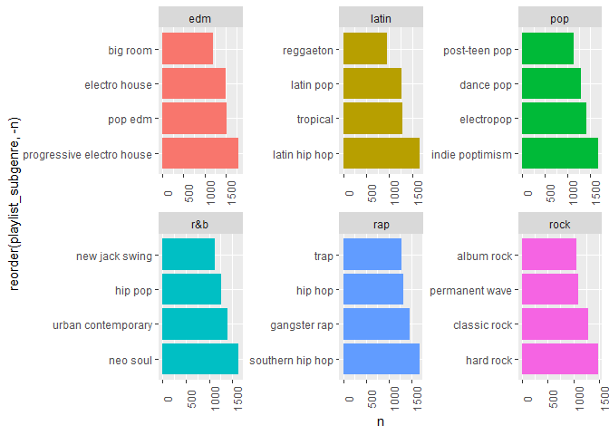
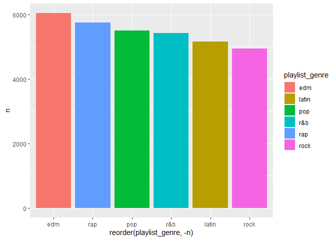
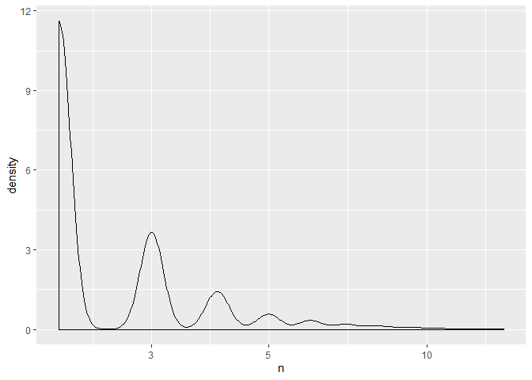
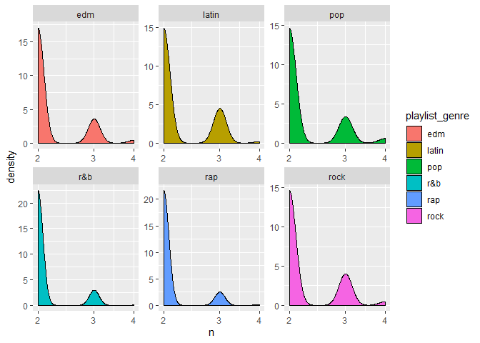
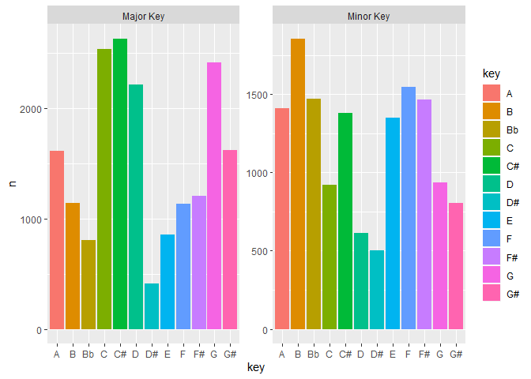
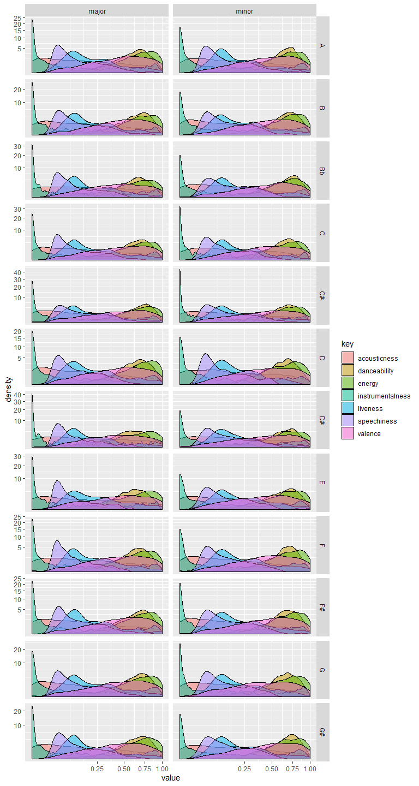

TidyTuesday Spotify 1/21/20
================
Andrew Couch
1/21/2020

## R Markdown

``` r
library(tidyverse)
```

    ## -- Attaching packages ----------------------------------------------------------------------------------------------------- tidyverse 1.3.0 --

    ## <U+2713> ggplot2 3.2.1     <U+2713> purrr   0.3.3
    ## <U+2713> tibble  2.1.3     <U+2713> dplyr   0.8.3
    ## <U+2713> tidyr   1.0.0     <U+2713> stringr 1.4.0
    ## <U+2713> readr   1.3.1     <U+2713> forcats 0.4.0

    ## -- Conflicts -------------------------------------------------------------------------------------------------------- tidyverse_conflicts() --
    ## x dplyr::filter() masks stats::filter()
    ## x dplyr::lag()    masks stats::lag()

``` r
spotify_songs <- readr::read_csv('https://raw.githubusercontent.com/rfordatascience/tidytuesday/master/data/2020/2020-01-21/spotify_songs.csv')
```

    ## Parsed with column specification:
    ## cols(
    ##   .default = col_double(),
    ##   track_id = col_character(),
    ##   track_name = col_character(),
    ##   track_artist = col_character(),
    ##   track_album_id = col_character(),
    ##   track_album_name = col_character(),
    ##   track_album_release_date = col_character(),
    ##   playlist_name = col_character(),
    ##   playlist_id = col_character(),
    ##   playlist_genre = col_character(),
    ##   playlist_subgenre = col_character()
    ## )

    ## See spec(...) for full column specifications.

``` r
#Basic understanding of dataset 
spotify_songs %>% glimpse()
```

    ## Observations: 32,833
    ## Variables: 23
    ## $ track_id                 <chr> "6f807x0ima9a1j3VPbc7VN", "0r7CVbZTWZgbTCYdf…
    ## $ track_name               <chr> "I Don't Care (with Justin Bieber) - Loud Lu…
    ## $ track_artist             <chr> "Ed Sheeran", "Maroon 5", "Zara Larsson", "T…
    ## $ track_popularity         <dbl> 66, 67, 70, 60, 69, 67, 62, 69, 68, 67, 58, …
    ## $ track_album_id           <chr> "2oCs0DGTsRO98Gh5ZSl2Cx", "63rPSO264uRjW1X5E…
    ## $ track_album_name         <chr> "I Don't Care (with Justin Bieber) [Loud Lux…
    ## $ track_album_release_date <chr> "2019-06-14", "2019-12-13", "2019-07-05", "2…
    ## $ playlist_name            <chr> "Pop Remix", "Pop Remix", "Pop Remix", "Pop …
    ## $ playlist_id              <chr> "37i9dQZF1DXcZDD7cfEKhW", "37i9dQZF1DXcZDD7c…
    ## $ playlist_genre           <chr> "pop", "pop", "pop", "pop", "pop", "pop", "p…
    ## $ playlist_subgenre        <chr> "dance pop", "dance pop", "dance pop", "danc…
    ## $ danceability             <dbl> 0.748, 0.726, 0.675, 0.718, 0.650, 0.675, 0.…
    ## $ energy                   <dbl> 0.916, 0.815, 0.931, 0.930, 0.833, 0.919, 0.…
    ## $ key                      <dbl> 6, 11, 1, 7, 1, 8, 5, 4, 8, 2, 6, 8, 1, 5, 5…
    ## $ loudness                 <dbl> -2.634, -4.969, -3.432, -3.778, -4.672, -5.3…
    ## $ mode                     <dbl> 1, 1, 0, 1, 1, 1, 0, 0, 1, 1, 1, 1, 1, 0, 0,…
    ## $ speechiness              <dbl> 0.0583, 0.0373, 0.0742, 0.1020, 0.0359, 0.12…
    ## $ acousticness             <dbl> 0.10200, 0.07240, 0.07940, 0.02870, 0.08030,…
    ## $ instrumentalness         <dbl> 0.00e+00, 4.21e-03, 2.33e-05, 9.43e-06, 0.00…
    ## $ liveness                 <dbl> 0.0653, 0.3570, 0.1100, 0.2040, 0.0833, 0.14…
    ## $ valence                  <dbl> 0.518, 0.693, 0.613, 0.277, 0.725, 0.585, 0.…
    ## $ tempo                    <dbl> 122.036, 99.972, 124.008, 121.956, 123.976, …
    ## $ duration_ms              <dbl> 194754, 162600, 176616, 169093, 189052, 1630…

``` r
#Probably don't need track_id, tack_album_id, playlist_id 
df <- spotify_songs %>% 
  select(-contains("id")) %>%
  glimpse()
```

    ## Observations: 32,833
    ## Variables: 20
    ## $ track_name               <chr> "I Don't Care (with Justin Bieber) - Loud Lu…
    ## $ track_artist             <chr> "Ed Sheeran", "Maroon 5", "Zara Larsson", "T…
    ## $ track_popularity         <dbl> 66, 67, 70, 60, 69, 67, 62, 69, 68, 67, 58, …
    ## $ track_album_name         <chr> "I Don't Care (with Justin Bieber) [Loud Lux…
    ## $ track_album_release_date <chr> "2019-06-14", "2019-12-13", "2019-07-05", "2…
    ## $ playlist_name            <chr> "Pop Remix", "Pop Remix", "Pop Remix", "Pop …
    ## $ playlist_genre           <chr> "pop", "pop", "pop", "pop", "pop", "pop", "p…
    ## $ playlist_subgenre        <chr> "dance pop", "dance pop", "dance pop", "danc…
    ## $ danceability             <dbl> 0.748, 0.726, 0.675, 0.718, 0.650, 0.675, 0.…
    ## $ energy                   <dbl> 0.916, 0.815, 0.931, 0.930, 0.833, 0.919, 0.…
    ## $ key                      <dbl> 6, 11, 1, 7, 1, 8, 5, 4, 8, 2, 6, 8, 1, 5, 5…
    ## $ loudness                 <dbl> -2.634, -4.969, -3.432, -3.778, -4.672, -5.3…
    ## $ mode                     <dbl> 1, 1, 0, 1, 1, 1, 0, 0, 1, 1, 1, 1, 1, 0, 0,…
    ## $ speechiness              <dbl> 0.0583, 0.0373, 0.0742, 0.1020, 0.0359, 0.12…
    ## $ acousticness             <dbl> 0.10200, 0.07240, 0.07940, 0.02870, 0.08030,…
    ## $ instrumentalness         <dbl> 0.00e+00, 4.21e-03, 2.33e-05, 9.43e-06, 0.00…
    ## $ liveness                 <dbl> 0.0653, 0.3570, 0.1100, 0.2040, 0.0833, 0.14…
    ## $ valence                  <dbl> 0.518, 0.693, 0.613, 0.277, 0.725, 0.585, 0.…
    ## $ tempo                    <dbl> 122.036, 99.972, 124.008, 121.956, 123.976, …
    ## $ duration_ms              <dbl> 194754, 162600, 176616, 169093, 189052, 1630…

``` r
#Looking at playlist genre and their subgenre
df %>% 
  select(playlist_genre, playlist_subgenre) %>% 
  count(playlist_genre, playlist_subgenre) %>% 
  ggplot(aes(x = reorder(playlist_subgenre, -n), y = n, fill = playlist_genre)) + 
  geom_col() + 
  facet_wrap(~playlist_genre, scales = "free") + 
  theme(axis.text.x = element_text(angle = 90),
        legend.position = "none") 
```

<!-- -->

``` r
#These are some long subgenre names 
#Progressive electro house, indie poptimisim, neo soul are genres that I am not familiar with 
```

``` r
df %>% 
  select(playlist_genre) %>% 
  count(playlist_genre) %>% 
  ggplot(aes(x = reorder(playlist_genre, -n), y = n, fill = playlist_genre)) + 
  geom_col()
```

<!-- -->

``` r
#EDM, rap, and pop are still popular however, Rock isnt as popular 
#Are songs labeled with multiple genres and subgenres? 
```

``` r
#What songs appear in multiple playlist genres?
df %>% 
  select(track_name, playlist_genre) %>% 
  unique() %>% 
  count(track_name) %>% 
  filter(n > 1) %>% 
  arrange(track_name) 
```

    ## # A tibble: 2,871 x 2
    ##    track_name                                             n
    ##    <chr>                                              <int>
    ##  1 'Till I Collapse                                       3
    ##  2 $ave Dat Money (feat. Fetty Wap & Rich Homie Quan)     2
    ##  3 (No One Knows Me) Like the Piano                       2
    ##  4 ...Baby One More Time                                  2
    ##  5 ¿Cual es tu plan?                                      2
    ##  6 ¿Quien Tu Eres?                                        2
    ##  7 +                                                      2
    ##  8 <U+30AC><U+30E9><U+30B9><U+306E>PALM TREE                                      2
    ##  9 <U+30DC><U+30A4><U+30B9><U+30E1><U+30E2> No. 5                                       2
    ## 10 <U+541B><U+306E><U+30CF><U+30FC><U+30C8><U+306F><U+30DE><U+30EA><U+30F3><U+30D6><U+30EB><U+30FC>                               2
    ## # … with 2,861 more rows

``` r
#A lot of songs appear in more than 1 however only one appears in 3
```

``` r
#What about subgenres? 
df %>% 
  select(track_name, playlist_subgenre) %>% 
  unique() %>% 
  count(track_name) %>% 
  filter(n > 1) %>% 
  arrange(-n, track_name)
```

    ## # A tibble: 4,441 x 2
    ##    track_name       n
    ##    <chr>        <int>
    ##  1 Breathe         14
    ##  2 Forever         14
    ##  3 Stay            14
    ##  4 Paradise        13
    ##  5 Alive           12
    ##  6 Memories        12
    ##  7 Dance Monkey    11
    ##  8 Lost            11
    ##  9 Poison          11
    ## 10 Without You     11
    ## # … with 4,431 more rows

``` r
#A lot of songs appear in more than 1 subgenre.
```

``` r
#Lets look at the distribution of overall subgenre appearances 
df %>% 
  select(track_name, playlist_subgenre) %>% 
  unique() %>% 
  count(track_name) %>% 
  filter(n > 1) %>% 
  ggplot(aes(x = n)) + 
  geom_density() + 
  scale_x_log10()
```

<!-- -->

``` r
df %>% 
  select(track_name, playlist_subgenre) %>% 
  unique() %>% 
  count(track_name) %>% 
  filter(n > 1) %>% 
  summary()
```

    ##   track_name              n         
    ##  Length:4441        Min.   : 2.000  
    ##  Class :character   1st Qu.: 2.000  
    ##  Mode  :character   Median : 2.000  
    ##                     Mean   : 2.692  
    ##                     3rd Qu.: 3.000  
    ##                     Max.   :14.000

``` r
#Lets look at it subgenre appearances by genre 
df %>% 
  select(track_name, playlist_genre, playlist_subgenre) %>% 
  unique() %>% 
  group_by(playlist_genre, playlist_genre) %>% 
  count(track_name) %>% 
  filter(n > 1) %>% 
  ggplot(aes(x = n, fill = playlist_genre)) + 
  geom_density() + 
  scale_x_log10() +
  facet_wrap(~playlist_genre, scales = "free")
```

<!-- -->

``` r
# iris %>% 
#   group_by(Species) %>% 
#   do(model = lm(Sepal.Length~Sepal.Width + Petal.Length, data = .)) %>% 
#   broom::augment(model)
```

``` r
#Lets look at the spotify features 
df %>% 
  select(9:20) %>% 
  summary()
```

    ##   danceability        energy              key            loudness      
    ##  Min.   :0.0000   Min.   :0.000175   Min.   : 0.000   Min.   :-46.448  
    ##  1st Qu.:0.5630   1st Qu.:0.581000   1st Qu.: 2.000   1st Qu.: -8.171  
    ##  Median :0.6720   Median :0.721000   Median : 6.000   Median : -6.166  
    ##  Mean   :0.6548   Mean   :0.698619   Mean   : 5.374   Mean   : -6.720  
    ##  3rd Qu.:0.7610   3rd Qu.:0.840000   3rd Qu.: 9.000   3rd Qu.: -4.645  
    ##  Max.   :0.9830   Max.   :1.000000   Max.   :11.000   Max.   :  1.275  
    ##       mode         speechiness      acousticness    instrumentalness   
    ##  Min.   :0.0000   Min.   :0.0000   Min.   :0.0000   Min.   :0.0000000  
    ##  1st Qu.:0.0000   1st Qu.:0.0410   1st Qu.:0.0151   1st Qu.:0.0000000  
    ##  Median :1.0000   Median :0.0625   Median :0.0804   Median :0.0000161  
    ##  Mean   :0.5657   Mean   :0.1071   Mean   :0.1753   Mean   :0.0847472  
    ##  3rd Qu.:1.0000   3rd Qu.:0.1320   3rd Qu.:0.2550   3rd Qu.:0.0048300  
    ##  Max.   :1.0000   Max.   :0.9180   Max.   :0.9940   Max.   :0.9940000  
    ##     liveness         valence           tempo         duration_ms    
    ##  Min.   :0.0000   Min.   :0.0000   Min.   :  0.00   Min.   :  4000  
    ##  1st Qu.:0.0927   1st Qu.:0.3310   1st Qu.: 99.96   1st Qu.:187819  
    ##  Median :0.1270   Median :0.5120   Median :121.98   Median :216000  
    ##  Mean   :0.1902   Mean   :0.5106   Mean   :120.88   Mean   :225800  
    ##  3rd Qu.:0.2480   3rd Qu.:0.6930   3rd Qu.:133.92   3rd Qu.:253585  
    ##  Max.   :0.9960   Max.   :0.9910   Max.   :239.44   Max.   :517810

``` r
#The music features are scaled 0-1 besides key, loudness, tempo, deuration_ms
```

``` r
spotifyDf <- df %>% select(9:20)
#Lets convertt duration_ms to minutes and seconds 
spotifyDf <-  spotifyDf %>% 
  mutate(minutes = duration_ms/60000) %>% 
  select(-duration_ms)
```

``` r
#Convert key numbers in letters using http://openmusictheory.com/pitch(Class).html
musickey <- data.frame(notation = c(0,1,2,3,4,5,6,7,8,9,10,11), 
                       key = c("C", "C#","D","D#","E","F","F#","G","G#","A","Bb","B"))

spotifyDf <- spotifyDf %>% 
  inner_join(musickey, by = c("key" = "notation")) %>% 
  mutate(key = key.y) %>% 
  select(-key.y)
```

``` r
spotifyDf %>% 
  select(key,mode) %>%
  mutate(mode = if_else(mode == 0, "Minor Key", "Major Key")) %>% 
  group_by(mode) %>% 
  count(key) %>% 
  mutate(key = as.factor(key)) %>% 
  ggplot(aes(x = key, y =n, fill = key)) + 
  geom_col() + 
  facet_wrap(~mode, scales = "free")
```

<!-- -->

``` r
options(scipen = 999)
spotifyDf %>% 
  select(-minutes, -tempo, -loudness) %>% 
  rename("musickey" = key, "major" = mode) %>% 
  mutate(major = if_else(major == 1, "major", "minor")) %>% 
  gather(key = "key", value = "value", -musickey,-major) %>% 
  arrange(major, musickey, key, value) %>% 
  ggplot(aes(x = value, fill = key, group = key)) + 
  geom_density(alpha = .5) +
  scale_x_sqrt() + 
  scale_y_sqrt() + 
  facet_grid(musickey~major, scales = "free")
```

<!-- -->
